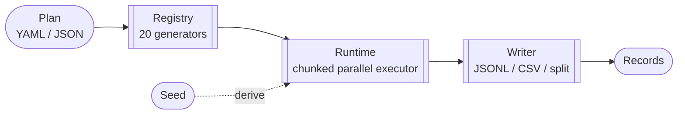

# Apery — Synthetic Data Generator for Agents

<p align="center">
  
</p>

<p align="center">
  <strong>Deterministic synthetic data generation for agents.</strong>
</p>

<p align="center">
  <a href="https://github.com/compuficial/apery/actions/workflows/ci.yml?branch=main"></a>
  <a href="https://github.com/compuficial/apery/releases"></a>
  <a href="https://discord.gg/apery"></a>
  <a href="LICENSE"></a>
</p>

Apery generates synthetic data from declarative plans. Same plan, same seed, same output — every time.

AI agents are a first-class citizen. Logs go to stderr so stdout stays clean for piping. Structured slog output, machine-parseable JSONL/CSV, clean exit codes.

## Install

**Pre-built binary** (Linux / macOS / Windows, amd64 / arm64):

```bash
# Linux x86_64 — pick the asset for your platform from the releases page
curl -L https://github.com/compuficial/apery/releases/latest/download/apery_<version>_linux_x86_64.tar.gz \
  | tar xz -C /tmp && sudo mv /tmp/apery /usr/local/bin/
```

See [releases](https://github.com/compuficial/apery/releases) for all platforms.

**Go install** (requires Go 1.24+):

```bash
go install github.com/compuficial/apery/cmd/apery@latest
```

**From source** (requires Go 1.24+):

```bash
git clone https://github.com/compuficial/apery.git
cd apery
make install   # builds and installs to ~/.local/bin
```

## 30-Second Demo

```yaml
# plan.yaml
seed: 42
entities:
  - name: User
    count: 1000
    fields:
      - name: id
        gen: seq
      - name: email
        gen: regex
        config:
          pattern: "[a-z]{5,10}@(gmail|yahoo|outlook)\\.com"
      - name: department
        gen: pick
        config:
          values: [engineering, sales, marketing, support]
          weights: [40, 30, 20, 10]
```

```bash
$ apery generate -f plan.yaml | head -3
{"_entity":"User","id":1,"email":"kczvbmih@outlook.com","department":"engineering"}
{"_entity":"User","id":2,"email":"yzdevl@yahoo.com","department":"engineering"}
{"_entity":"User","id":3,"email":"eoikwpvxu@gmail.com","department":"sales"}
```

## Why Apery

| | |
|---|---|
| **Deterministic** | `Plan + Seed = Identical Output`. Always. Across parallel workers, platforms, runs. |
| **Fast** | Chunked parallel execution across all cores. See [Performance](#performance) for numbers. |
| **Composable** | 20 generators that nest and combine. Objects, lists, templates, conditional dispatch. |
| **Relational** | Foreign keys, 1:M parent-child, M:N junction tables. Zipf distributions for realistic skew. |
| **Agent-first** | YAML/JSON plans, stdout piping, structured slog output, exit codes. No GUI, no server. |
| **Zero config** | Single binary. No database, no runtime dependencies. |

## Generators

Run `apery list generators` to see all available generators, or `apery describe generator <name>` for full config docs.

### Scalar

| Generator | Description | Example Config |
|-----------|-------------|----------------|
| `seq` | Sequential integers | `start: 1, step: 1` |
| `int` | Uniform random integer | `min: 0, max: 100` |
| `float` | Uniform random float | `min: 0.0, max: 1.0` |
| `bool` | Weighted boolean | `probability: 0.8` |
| `pick` | Random from list/file/URL | `values: [a, b, c], weights: [5, 3, 2]` |
| `const` | Fixed value | `value: active` |
| `regex` | String from pattern | `pattern: "[A-Z]{2}-\\d{6}"` |
| `time` | Timestamp in range | `start: "2024-01-01", end: "2024-12-31"` |
| `uuid` | UUID v4 | — |
| `ulid` | ULID | — |
| `normal_int` | Gaussian integer | `mu: 50, sigma: 10` |
| `normal_float` | Gaussian float | `mu: 0.0, sigma: 1.0` |
| `zipf` | Zipf distribution | `s: 1.1, imax: 100` |

### Composite

| Generator | Description |
|-----------|-------------|
| `object` | Nested object with sub-generators per field |
| `list` | Array of N items from one generator |
| `sample` | N unique items without replacement |
| `one_of` | Weighted random dispatch to sub-generators |
| `template` | String interpolation: `"{first} {last}"` |
| `switch` | Conditional dispatch based on another field |

### Relational

| Generator | Description |
|-----------|-------------|
| `rel_ref` | Foreign key from a previously generated entity (uniform or zipf, optional `unique: true`) |
| `driven_by` | 1:M parent-child — generate Min to Max children per parent row |

## Relational Example

```yaml
seed: 99
entities:
  - name: User
    count: 100
    fields:
      - name: id
        gen: seq
      - name: name
        gen: pick
        config:
          values: [Alice, Bob, Carol, Dave]

  - name: Product
    count: 50
    fields:
      - name: id
        gen: seq
      - name: sku
        gen: regex
        config:
          pattern: "[A-Z]{2}-\\d{6}"

  - name: Order                    # 1:M — each User gets 1-5 Orders
    driven_by:
      entity: User
      field: id
      as: user_id
      min: 1
      max: 5
    fields:
      - name: order_id
        gen: seq
      - name: product_id
        gen: rel_ref
        config:
          entity: Product
          field: id
      - name: quantity
        gen: int
        config:
          min: 1
          max: 10

  - name: Review                   # M:1 with zipf skew
    count: 500
    fields:
      - name: user_id
        gen: rel_ref
        config:
          entity: User
          field: id
          distribution: zipf
          s: 1.5
      - name: product_id
        gen: rel_ref
        config:
          entity: Product
          field: id
      - name: rating
        gen: int
        config:
          min: 1
          max: 5
```

```bash
$ apery generate -f ecommerce.yaml --output-dir ./out --split-entities
$ ls out/
Order.jsonl  Product.jsonl  Review.jsonl  User.jsonl

$ head -1 out/Order.jsonl | jq .
{
  "user_id": 1,
  "order_id": 1,
  "product_id": 34,
  "quantity": 7
}
```

## CLI Reference

```
apery generate -f plan.yaml              # JSONL to stdout
apery generate -f plan.yaml -o csv       # CSV to stdout
apery generate -f plan.yaml --output-dir ./out
apery generate -f plan.yaml --output-dir ./out --split-entities
apery generate -f plan.yaml --dry-run    # validate only
apery generate -f plan.yaml --seed 123   # override seed
apery generate -f plan.yaml --verbose    # entity progress to stderr
apery generate -f plan.yaml --debug      # full debug output to stderr

apery validate -f plan.yaml              # validate a plan file
apery list generators                    # list all generators
apery describe generator <name>          # show config schema + example
apery version                            # print version
apery help <command>                     # help for any command
```

**Exit codes:** `0` success, `1` validation error, `2` generation error, `3` I/O error.

## Performance

```bash
$ cat bench.yaml
seed: 1
entities:
  - name: Row
    count: 1000000
    fields:
      - name: id
        gen: seq
      - name: value
        gen: int
        config: { min: 0, max: 1000000 }
      - name: label
        gen: pick
        config: { values: [a, b, c, d, e] }

$ time apery generate -f bench.yaml --workers 16 > /dev/null
real    0m1.6s
```

Numbers depend heavily on plan shape (regex, `rel_ref`, composite generators are more expensive than scalar `seq`/`int`/`pick`) and whether output is piped to a file or a terminal. Run your own plan with `--workers $(nproc) > /dev/null` to get a representative number for your workload.

## Determinism

```bash
$ apery generate -f plan.yaml --seed 42 | md5sum
fc8756b572010e94b46afc81ecbe6a02  -
$ apery generate -f plan.yaml --seed 42 | md5sum
fc8756b572010e94b46afc81ecbe6a02  -
```

Hierarchical seed derivation ensures identical output regardless of worker count or chunk size. See the [spec](docs/spec.md) for the full seed derivation model.

## Go Library

```go
import "apery"

p, _ := apery.LoadPlanFile("plan.yaml")

w, _ := apery.NewJSONLWriter("output.jsonl")
apery.Run(ctx, p, w,
    apery.WithWorkers(16),
    apery.WithChunkSize(100000),
)
```

## Architecture



| Stage | Package | Responsibility |
|-------|---------|----------------|
| **Plan** | [`internal/plan`](internal/plan) | Load + validate YAML/JSON into entities, fields, and generator configs. |
| **Registry** | [`internal/registry`](internal/registry) | Generator factory. Built-ins auto-register at init time; each is self-describing via `GeneratorInfo`. |
| **Runtime** | [`internal/runtime`](internal/runtime) | Chunked parallel executor. Row-by-row generation with cross-entity column store for relational lookups. Structured `slog` logging. |
| **Writer** | [`internal/writer`](internal/writer) | Streaming output: single JSONL/CSV file, stdout, or per-entity split files. |

**Determinism is the core invariant.** Seeds cascade deterministically via FNV-1a derivation:

```
root seed ─▶ entity ─▶ field ─▶ row ─▶ sub-field
```

Same plan + same seed = byte-identical output, regardless of worker count, platform, or run. See [`docs/spec.md`](docs/spec.md) for the full execution model.

## Documentation

- **[Specification](docs/spec.md)** — Architecture, plan schema, generator reference, execution model
- **[Usage Guide](docs/usage.md)** — Practical CLI walkthrough with example plans

## License

MIT
