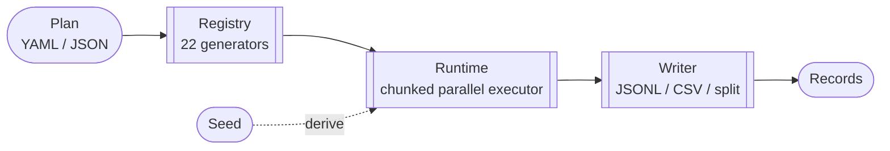

# Apery — Specification

Apery is a deterministic synthetic data generator written in Go. Given a declarative plan and a seed, it produces byte-identical output on every run, every platform, every worker count.

This document is the reference spec for the code in this repository. It is grounded in the implementation — if this document and the code disagree, the code wins and the spec is wrong.

See [`docs/usage.md`](usage.md) for a practical walkthrough with worked examples.

---

## 1. Overview

- **Purpose**: generate schema-driven synthetic data for AI agents, tests, demos, benchmarks, and fixtures.
- **Interface**: a single CLI (`apery`) and a small Go library (`github.com/compuficial/apery`).
- **Input**: a declarative plan in YAML or JSON.
- **Output**: streaming JSONL or CSV — stdout, a file, or one file per entity.
- **Runtime**: Go 1.24+, single static binary, no runtime dependencies.

Apery is designed to be driven by agents and scripts first. Silent stdout, machine-parseable output, explicit exit codes, and structured stderr logging make it predictable to automate.

---

## 2. Design Principles

- **Deterministic.** `Plan + Seed` produces byte-identical output across runs, platforms, worker counts, and chunk sizes. This is the central invariant — everything else yields to it.
- **Declarative.** Plans describe *what* to generate, not *how*. The engine owns parallelism, chunking, seed derivation, and ordering.
- **Composable.** A small set of universal generators compose via nesting (`object`, `list`), templates, conditional dispatch (`switch`), and value lists. No domain-specific generators.
- **Streaming.** Records are written as they're produced. Memory is bounded by chunk size, not row count.
- **Zero runtime deps.** One binary. No database, no server, no external services.

---

## 3. Architecture



| Stage | Package | Role |
|-------|---------|------|
| **Plan** | [`internal/plan`](../internal/plan) | Parse and validate YAML/JSON into entities, fields, relational constraints. |
| **Registry** | [`internal/registry`](../internal/registry) | Generator factories and interfaces. Built-ins auto-register via `init()`; each is self-describing via `GeneratorInfo`. |
| **Runtime** | [`internal/runtime`](../internal/runtime) | Executor: seed derivation, chunked parallel generation, driven_by layout, cross-entity column store, `slog` structured logging. |
| **Writer** | [`internal/writer`](../internal/writer) | JSONL, CSV, and per-entity split output. `OrderedMap` preserves field order. |
| **RNG** | [`internal/rng`](../internal/rng) | PCG64-backed deterministic PRNG with FNV-1a seed derivation; implements `io.Reader` for entropy-consuming libraries (ULID). |
| **CLI** | [`cmd/apery`](../cmd/apery) | Cobra subcommands: `generate`, `validate`, `list`, `describe`, `version`. |

### Public Go API

`run.go` re-exports the library surface:

```go
plan, _ := apery.LoadPlanFile("plan.yaml")
w, _   := apery.NewJSONLWriter("out.jsonl")
_      = apery.Run(ctx, plan, w, apery.WithWorkers(8))
```

---

## 4. Plan Schema

A plan contains a root seed and an ordered list of entities. Entities that reference others (via `rel_ref` or `driven_by`) must be declared **after** their dependencies.

### 4.1 Go types

From [`internal/plan/plan.go`](../internal/plan/plan.go):

```go
type Plan struct {
    Seed     int64        `yaml:"seed"     json:"seed"`
    Entities []EntitySpec `yaml:"entities" json:"entities"`
}

type EntitySpec struct {
    Name     string      `yaml:"name"                 json:"name"`
    Count    int64       `yaml:"count,omitempty"      json:"count,omitempty"`
    DrivenBy *DrivenBy   `yaml:"driven_by,omitempty"  json:"driven_by,omitempty"`
    Fields   []FieldSpec `yaml:"fields"               json:"fields"`
}

type DrivenBy struct {
    Entity  string        `yaml:"entity"             json:"entity"`   // parent entity name
    Field   string        `yaml:"field"              json:"field"`    // parent field to inject (the join key)
    As      string        `yaml:"as"                 json:"as"`       // name for the injected join key in child
    Min     int64         `yaml:"min"                json:"min"`      // minimum children per parent (>= 1)
    Max     int64         `yaml:"max"                json:"max"`      // maximum children per parent (>= Min)
    Expose  []ParentField `yaml:"expose,omitempty"   json:"expose,omitempty"`   // extra parent columns to expose in each child
    IndexAs string        `yaml:"index_as,omitempty" json:"index_as,omitempty"` // inject the 0-based child index under this name
}

type ParentField struct {
    Field string `yaml:"field"        json:"field"`        // parent field name
    As    string `yaml:"as,omitempty" json:"as,omitempty"` // child column name (defaults to Field)
}

type FieldSpec struct {
    Name   string         `yaml:"name"             json:"name"`
    Gen    string         `yaml:"gen"              json:"gen"`
    Config map[string]any `yaml:"config,omitempty" json:"config,omitempty"`
}
```

### 4.2 YAML example

```yaml
seed: 42
entities:
  - name: User
    count: 10000
    fields:
      - name: id
        gen: seq
      - name: email
        gen: regex
        config:
          pattern: "[a-z]{5,10}@(gmail|yahoo)\\.com"

  - name: Order
    driven_by:
      entity: User
      field: id
      as: user_id
      min: 1
      max: 5
    fields:
      - name: order_id
        gen: ulid
      - name: amount
        gen: float
        config:
          min: 9.99
          max: 999.99
```

### 4.3 Validation rules

Enforced by `plan.Validate` in [`internal/plan/validate.go`](../internal/plan/validate.go):

**Entity-level**
- Name is non-empty and unique across the plan.
- Exactly one of `Count` or `DrivenBy` must be set.
- At least one field must be defined.
- Field names within an entity must be unique. The columns `driven_by` injects (`As`, every `expose` alias, and `index_as`) must be distinct from each other and must not collide with a declared field.
- Config keys with a leading underscore (`_store`, etc.) are reserved and rejected.

**Relational**
- A `DrivenBy` parent entity must be declared before the child.
- `DrivenBy.Field` and every `DrivenBy.Expose[i].Field` must exist on the parent entity (including the parent's own injected columns, if any).
- `DrivenBy.Min >= 1` and `DrivenBy.Max >= DrivenBy.Min`.
- A `rel_ref` target entity must be declared before the referencing entity, and the target field must exist on it.
- For `unique: true` `rel_ref` inside a `driven_by` entity, `DrivenBy.Max` must not exceed the target entity's `Count` (feasibility check).

---

## 5. Generators

22 built-in generators, grouped by shape. Full config reference via `apery describe generator <name>`.

### 5.1 Scalar

| Generator | Required | Optional | Output | Description |
|-----------|----------|----------|--------|-------------|
| `seq`          | —                  | `start` (int=1), `step` (int=1, nonzero) | `int64`  | Sequential integer, optionally per-row seekable |
| `const`        | `value` (any)      | —                                       | any      | Fixed literal on every row |
| `bool`         | —                  | `probability` (float=0.5, [0,1])        | `bool`   | Weighted boolean |
| `int`          | —                  | `min` (int=0), `max` (int=100)          | `int64`  | Uniform integer in range |
| `float`        | —                  | `min` (float=0.0), `max` (float=100.0)  | `float64`| Uniform float in range |
| `normal_int`   | —                  | `mu` (=0.0), `sigma` (=1.0), `clamp_min`, `clamp_max` | `int64`  | Gaussian integer with optional clamp |
| `normal_float` | —                  | `mu` (=0.0), `sigma` (=1.0), `clamp_min`, `clamp_max` | `float64`| Gaussian float with optional clamp |
| `zipf`         | —                  | `s` (=1.1), `v` (=1.0), `imax` (=100)   | `uint64` | Zipf-distributed integer |
| `pick`         | one of `values` \| `file` \| `url` | `weights`, `allowlist` (required with `url`) | any | Random selection from inline list, file, or URL |
| `uuid`         | —                  | —                                       | `string` | UUID v4 |
| `ulid`         | —                  | —                                       | `string` | ULID (sortable) |
| `time`         | —                  | `start`, `end`, `format`, `tz`          | `string` | Timestamp in range; defaults `2020-01-01`..`2030-12-31`, RFC3339 UTC |
| `regex`        | `pattern`          | `max_repeat` (int=10)                   | `string` | String matching a regex-subset pattern |

### 5.2 Composite

| Generator  | Required | Optional | Output | Description |
|------------|----------|----------|--------|-------------|
| `object`   | `fields` (map of sub-specs) | —                    | map    | Nested object; sub-fields get deterministic sub-seeds derived by name |
| `list`     | `item` (sub-spec)           | `len` \| (`min_len` + `max_len`) | `[]any` | Array from one generator |
| `sample`   | one of `values` \| `file` \| `url` | `n` \| (`min_n` + `max_n`), `weights`, `allowlist` | `[]any` | N unique items without replacement |
| `one_of`   | `generators` ([]sub-spec)   | `weights`            | any    | Weighted random dispatch to one of several generators |
| `template` | `tpl` (string with `{field}` refs) | —             | `string` | Row-aware string interpolation |
| `switch`   | `key`, `cases` (map)        | `default` (sub-spec) | any    | Row-aware conditional dispatch based on another field's value |

`template` and `switch` are **row-aware**: they read previously generated fields in the current row. Both declare their field dependencies so the executor can enforce earlier-field ordering.

### 5.3 Computed (row-aware)

| Generator | Required | Optional | Output | Description |
|-----------|----------|----------|--------|-------------|
| `expr`        | `expr` (string) | — | `int64` \| `float64` | Arithmetic over `{field}` refs and numeric literals: `+ - * /`, parentheses, unary minus |
| `date_offset` | `base`, `amount`, `unit` | `format` (Go layout, default RFC3339) | `string` | Shift a base date by N `years`\|`months`\|`days`\|`hours`\|`minutes`\|`seconds` |

These close the cross-row arithmetic/temporal gap (see §6.4). Both are **row-aware** and declare dependencies.

- `expr` reads numeric fields and emits an `int64` when the result is a whole number, otherwise a `float64`. Referencing a missing or non-numeric field, or dividing by zero, is a row-time error. Example: `expr: "{sub_total} / 12"`.
- `date_offset` takes a `base` (a date literal or a `{field}` reference) and an `amount` and shifts it by `unit`. The `amount` is an `expr`-style expression string — a field (`"{event_index}"`) or arithmetic (`"{quarter} * 3"`, `"-2"`) — so `date_offset` composes the `expr` engine rather than reimplementing field arithmetic. A bare number is also accepted as a convenience for a constant offset (`amount: 1`), the same way the numeric generators accept `1` for `1.0`. Calendar units (`years`/`months`/`days`) use `time.AddDate` and normalize overflow the Go way (e.g. Jan 31 + 1 month → Mar 3); clock units add a fixed, overflow-checked duration. The same `format` is used to parse `base` and to render the result. Example: `base: "{sub_start}", amount: "{event_index}", unit: months`.

### 5.4 Relational

| Generator | Required | Optional | Output | Description |
|-----------|----------|----------|--------|-------------|
| `rel_ref` | `entity`, `field` | `distribution` (`uniform` \| `zipf`, default `uniform`), `s` (zipf skew), `unique` (bool, default false) | any | Foreign key sampled from a previously generated entity column |

`rel_ref` is injected with an internal `_store` reference at chunk instantiation; it implements `Resettable` so unique-trackers are cleared between parent batches in driven_by entities.

### 5.5 Regex subset

The `regex` generator supports the generatable portion of RE2:

- **Supported**: literals, concatenation, alternation, grouping, character classes (including Unicode), quantifiers (`*`, `+`, `?`, `{m}`, `{m,n}`, `{m,}`), anchors `^` and `$` at start/end only.
- **Rejected with a validation error**: word boundaries (`\b`/`\B`), lookahead, lookbehind, backreferences, recursion, conditionals.
- **Character domain**: `.` generates printable ASCII (32–126). Character classes are rune-based and cover full Unicode.
- Unbounded quantifiers are capped by `max_repeat` (default 10).

---

## 6. Relational Model

### 6.1 M:1 — `rel_ref`

Sample values from a previously generated entity's column.

```yaml
- name: user_id
  gen: rel_ref
  config:
    entity: User
    field: id
    distribution: zipf   # "uniform" (default) or "zipf"
    s: 1.5               # zipf skew; only used when distribution: zipf
    unique: false        # true → no duplicate picks within a parent batch
```

Distribution:
- **uniform** — equal probability across all parent values
- **zipf** — skewed "hot key" distribution parameterised by `s`

### 6.2 1:M — `driven_by`

Set on the child entity. The executor generates `Min` to `Max` child rows per parent row; the parent's `Field` value is auto-injected into each child row under `As`.

```yaml
- name: Order
  driven_by:
    entity: User
    field: id
    as: user_id
    min: 1
    max: 5
  fields:
    - name: order_id
      gen: ulid
```

Child count per parent is deterministic, derived from the parent index and a dedicated count seed (see §7.1).

**Exposing more of the parent + the child index.** Beyond the single join key, `expose` injects additional parent columns into every child row, and `index_as` injects the child's **0-based** position within its parent's batch. All injected columns are ordinary row values, so any row-aware generator (`template`, `switch`, `expr`, `date_offset`) can read them:

```yaml
- name: Recognition
  driven_by:
    entity: Subscription
    field: id
    as: subscription_id
    min: 12
    max: 12
    expose:
      - { field: start_date, as: sub_start }   # `as` defaults to the parent field name
      - { field: total, as: sub_total }
    index_as: event_index                        # 0, 1, 2, … within each subscription
  fields:
    - name: recognized_at
      gen: date_offset
      config: { base: "{sub_start}", amount: "{event_index}", unit: months, format: "2006-01-02" }
    - name: amount
      gen: expr
      config: { expr: "{sub_total} / 12" }
```

Injected columns appear first in each child row, in order: the `As` join key, then `expose` entries (declared order), then `index_as`.

### 6.3 M:N — composition, not a built-in

M:N is expressed as a junction entity with `driven_by` (1:M from the left side) and a `unique` `rel_ref` (M:1 to the right side):

```yaml
- name: UserTag              # junction
  driven_by:
    entity: User
    field: id
    as: user_id
    min: 1
    max: 5
  fields:
    - name: tag_id
      gen: rel_ref
      config:
        entity: Tag
        field: id
        unique: true          # no duplicate tags per user
```

There is intentionally no `m2m` generator; composition keeps the engine small and the plan explicit.

### 6.4 Cross-row dependent values

Cross-row state used to be limited to foreign-key lookups (`rel_ref`). Three pieces combine to let a child row's values *derive* from its parent and its ordinal:

1. **`driven_by.expose`** — read multiple parent columns, not just the join key.
2. **`driven_by.index_as`** — the child's 0-based position within its parent batch.
3. **`expr` / `date_offset`** — compute a field from those columns (arithmetic / temporal offset).

Because exposed columns and the index are plain row values and the compute generators are row-aware, the whole thing is just composition — no new execution machinery. The worked example above generates a yearly subscription's 12 monthly revenue-recognition events where `recognized_at = start_date + event_index months` and `amount = total / 12`. A refund issued a month later after the FX rate moved is the same shape: `expose` the charge's `charged_at`, `amount`, and `fx_rate`, then `refunded_at = date_offset(charged_at, +1 month)` and `refund = expr({amount} * {fx_rate})`. See [`examples/subscriptions.yaml`](../examples/subscriptions.yaml).

Determinism is preserved: `expr` and `date_offset` are pure functions of row values (they ignore the RNG), and the injected index is computed from global row position, so output is identical regardless of worker count or chunk size.

---

## 7. Execution Model

### 7.1 Seed derivation hierarchy

Every level derives deterministically from its parent seed via FNV-1a label hashing or index XOR, followed by a bit-mix:

```
Root Seed (Plan.Seed)
 └─ Entity Seed: Derive(root, "EntityName[index]")
    ├─ Field Seed: Derive(entitySeed, fieldName)
    │  └─ Row Seed:  DeriveIndex(fieldSeed, rowIndex)
    │     └─ Sub-field Seed: Derive(rowSeed, subFieldName)   # composite generators
    └─ Count Seed: Derive(entitySeed, "counts")              # driven_by only
       └─ Per-parent count: DeriveIndex(countSeed, parentIndex)
```

Key properties:
- **Hierarchical** — each level is isolated from siblings.
- **Order-independent for composite generators** — sub-seeds derive from names, not list positions.
- **Parallel-safe** — a row seed depends only on field seed + row index, never on execution order.

### 7.2 RNG internals

Implemented in [`internal/rng/rng.go`](../internal/rng/rng.go).

- `Seed` is `uint64`; `SeedFromInt64` converts plan seeds.
- Backed by `rand.NewPCG(seed, 0)` (Go stdlib PCG64).
- `Derive(parent, label)` — FNV-1a of label, XOR with parent, then 64-bit mix.
- `DeriveIndex(parent, index)` — XOR with index, then mix.
- `GetSeed()` returns the construction seed; composite generators use it to derive per-sub-field seeds deterministically.
- `Rng` implements `io.Reader`, so it can feed libraries like `ulid.New()` that expect an entropy source.

### 7.3 Chunked parallel execution

- **Default chunk size**: 50,000 rows (`--chunk-size` to override).
- **Default worker count**: `min(2 × NumCPU, 64)` (`--workers` to override).
- Each chunk gets its own generator instances (factories are called per-chunk), keeping goroutines isolated.
- Chunks execute in parallel; the executor reassembles results in row order before writing.
- Standalone entities that include a `unique: true` `rel_ref` fall back to a single worker to keep the uniqueness set coherent.

### 7.4 Two-phase driven_by

A driven entity is executed in two phases, because child counts depend on the parent row count and must be known before chunking:

1. **Layout** — compute per-parent child counts via the count seed, then prefix-sum to get child row offsets. Total child rows and parent-boundary positions are now known.
2. **Generation** — chunked parallel execution over the total child-row range, with each worker tracking which parent's batch it is inside.

### 7.5 Parent-aligned chunking

When a driven entity contains a `unique: true` `rel_ref`, chunks are aligned to parent boundaries so a `Resettable` generator's per-parent state is always local to a single worker.

### 7.6 Cross-entity column store

[`internal/runtime/entity_store.go`](../internal/runtime/entity_store.go) holds columns from completed entities for downstream reference.

```go
type EntityStore interface {
    ReadOnlyEntityStore
    StoreColumn(entity, field string, values []any)
}

type ReadOnlyEntityStore interface {
    GetColumn(entity, field string) ([]any, bool)
}
```

The executor scans the plan to determine which (entity, field) pairs downstream entities will need, captures only those columns after each entity finishes, and injects the store into `rel_ref` factories via the reserved `_store` config key at chunk time.

### 7.7 Generator interfaces

From [`internal/registry/registry.go`](../internal/registry/registry.go):

```go
type Generator interface {
    Next(r *rng.Rng) (any, error)
}

type RowAwareGenerator interface {
    Generator
    NextWithRow(r *rng.Rng, row RowContext) (any, error)
}

type DependencyDeclarer interface {
    Dependencies() []string
}

type Resettable interface {
    Reset()
}
```

- `RowAwareGenerator` — `template`, `switch`, `expr`, `date_offset`. The executor calls `NextWithRow` when this interface is satisfied, giving access to already-generated fields in the current row.
- `DependencyDeclarer` — `template`, `switch`, `expr`, `date_offset`. Declared dependencies are validated to appear earlier in the field list.
- `Resettable` — `rel_ref` (when `unique: true`). Reset at parent-batch boundaries inside driven_by entities.

---

## 8. Writers

### 8.1 Interface

```go
type Writer interface {
    WriteRecord(entity string, record *OrderedMap) error
    Close() error
}
```

`OrderedMap` preserves field insertion order so output column order matches plan field order — deterministic by construction.

### 8.2 JSONL

Newline-delimited JSON, one record per line. The `_entity` field is prepended (single-stream mode only):

```json
{"_entity":"User","id":1,"email":"kczvbmih@outlook.com"}
{"_entity":"User","id":2,"email":"yzdevl@yahoo.com"}
```

Constructors: `NewJSONLWriter(path)`, `NewJSONLWriterFromWriter(io.Writer)`.

### 8.3 CSV

Streaming CSV. The header is emitted on the first record; subsequent records follow the same column order.

```csv
_entity,id,email
User,1,kczvbmih@outlook.com
User,2,yzdevl@yahoo.com
```

Constructors: `NewCSVWriter(path)`, `NewCSVWriterFromWriter(io.Writer)`.

### 8.4 Split

`NewSplitWriter(dir, format)` routes records to one file per entity. In split mode the `_entity` column is omitted from each file (the filename carries the entity identity).

```
out/
├── User.jsonl
├── Product.jsonl
└── Order.jsonl
```

Format is `jsonl` or `csv`. Files are created lazily on first write.

---

## 9. Determinism Guarantee

**Plan + Seed = identical output.** Always.

This holds across:
- Worker count, chunk size, and `GOMAXPROCS`.
- Platform (explicit `int64` / `float64` throughout; no dependency on host-native integer width).
- Field ordering within composite generators (sub-seeds derive from names, not positions).
- `driven_by` child counts (each parent's child count is derived from the parent index, not execution order).

Golden-file regression tests in [`internal/runtime/determinism_helpers_test.go`](../internal/runtime/determinism_helpers_test.go) pin the byte-exact output of canonical plans, and a stress suite exercises the same plans under varied worker and chunk combinations.

---

## 10. CLI Reference

### 10.1 `apery generate`

Defined in [`cmd/apery/generate.go`](../cmd/apery/generate.go).

| Flag | Default | Description |
|------|---------|-------------|
| `-f`, `--file`       | —       | Plan file path (required) |
| `-o`, `--output`     | `jsonl` | Output format: `jsonl` or `csv` |
| `--output-dir`       | —       | Write to a directory instead of stdout |
| `--split-entities`   | `false` | One file per entity (requires `--output-dir`) |
| `--dry-run`          | `false` | Load and validate the plan; produce no data |
| `--seed`             | —       | Override the plan's seed |
| `--workers`          | auto    | Parallel worker count (auto = `min(2 × NumCPU, 64)`) |
| `--chunk-size`       | `50000` | Rows per chunk |
| `--verbose`          | `false` | Entity progress on stderr (slog Info) |
| `--debug`            | `false` | Detailed seeds / chunks / layout on stderr (slog Debug) |

### 10.2 `apery validate`

```
apery validate -f plan.yaml
```

Loads the plan and runs validation. Prints `Plan is valid.` on success; exits with code `1` on failure.

### 10.3 `apery list generators` / `apery describe generator <name>`

```
apery list generators                  # tabular list of all generators
apery describe generator int           # config schema + YAML example
apery describe generator rel_ref
```

`describe` prints the name, description, config key table (key, type, required, default, description), and a ready-to-paste YAML example. Output is driven by the `GeneratorInfo` metadata registered alongside each generator.

### 10.4 `apery version`

Prints the injected build version. `apery --version` also works via Cobra.

### 10.5 Exit codes

From [`cmd/apery/main.go`](../cmd/apery/main.go):

| Code | Meaning |
|------|---------|
| 0 | Success |
| 1 | Plan or flag validation error |
| 2 | Generation error |
| 3 | I/O error (e.g., cannot create output file) |

---

## 11. Go Library API

`run.go` is the public package surface.

### Types

```go
type (
    Plan       = plan.Plan
    EntitySpec = plan.EntitySpec
    FieldSpec  = plan.FieldSpec
    DrivenBy   = plan.DrivenBy

    Writer     = writer.Writer
    OrderedMap = writer.OrderedMap

    Option = runtime.Option

    GeneratorInfo = registry.GeneratorInfo
    ConfigKey     = registry.ConfigKey
)
```

### Functions

```go
func LoadPlanFile(path string) (*Plan, error)
func ValidatePlan(p *Plan) error
func ListGenerators() []GeneratorInfo

func NewJSONLWriter(path string)           (*writer.JSONLWriter, error)
func NewCSVWriter(path string)             (*writer.CSVWriter, error)
func NewJSONLWriterFromWriter(w io.Writer) *writer.JSONLWriter
func NewCSVWriterFromWriter(w io.Writer)   *writer.CSVWriter
func NewSplitWriter(dir, format string)    *writer.SplitWriter

func WithLogger(l *slog.Logger) Option
func WithWorkers(n int)         Option
func WithChunkSize(n int64)     Option

func Run(ctx context.Context, p *Plan, w Writer, opts ...Option) error
```

### Example

```go
import "github.com/compuficial/apery"

p, err := apery.LoadPlanFile("plan.yaml")
if err != nil { return err }

w, err := apery.NewJSONLWriter("out.jsonl")
if err != nil { return err }
defer w.Close()

return apery.Run(ctx, p, w,
    apery.WithWorkers(8),
    apery.WithChunkSize(100_000),
)
```

---

## 12. Extensibility: Adding a Generator

1. Create a file in `internal/registry/`, e.g. `mygen.go`.
2. Implement the `Generator` interface:
   ```go
   type MyGenerator struct { /* ... */ }

   func (g *MyGenerator) Next(r *rng.Rng) (any, error) { /* ... */ }
   ```
3. Register in an `init()`:
   ```go
   func init() {
       MustRegister("mygen", func(config map[string]any) (Generator, error) {
           // validate config, build generator
           return &MyGenerator{/* ... */}, nil
       })
       MustRegisterInfo("mygen", GeneratorInfo{ /* description, keys, example */ })
   }
   ```
4. Add a field using the new generator to the appropriate canonical plan in [`internal/runtime/determinism_helpers_test.go`](../internal/runtime/determinism_helpers_test.go) (scalar, composite, row-aware, relational, or dependent). If the generator doesn't fit any existing category, add a new canonical plan to the `canonicalPlans` slice.
5. Regenerate golden files:
   ```
   go test ./internal/runtime -run TestGolden -update -v
   ```
6. Review the golden diff; commit the generator, metadata, and golden update together.

Determinism is the contract. Any new generator must be pure in the seed it is given — no hidden globals, no `time.Now`, no environment reads.

---

## 13. Non-Goals

Things Apery is deliberately **not**, so the scope doesn't drift:

- No natural-language plan compiler. Plans are YAML or JSON, written by humans or emitted by agents.
- No HTTP server, no GraphQL, no MCP server. The CLI is the interface.
- No GUI.
- No Parquet, SQL, or ML-training-format writers (SFT/DPO/RLHF). JSONL and CSV are the output formats.
- No bundled catalogs of names / companies / addresses. Use `pick` with a `values`, `file`, or allowlisted `url` source.
- No OpenTelemetry or distributed tracing. Observability is local stderr logging via `slog`.
- No cross-version RNG compatibility. Seed output is stable within a released version; upgrading the RNG is a breaking change.
- No data obfuscation, anonymization, or privacy guarantees. Apery generates synthetic data; it does not transform real data.
